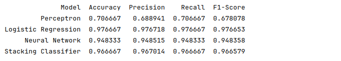
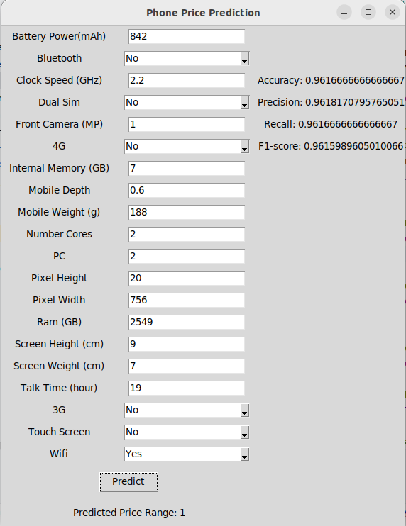

# Dự án bao gồm:

<b>Bài toán Xây dựng giao diện dự đoán phân giá điện thoại qua các thông số của nó</b>>

Thực hiện train riêng từng model phân lớp Logistic Regression, Perceptron, Neural Network và tìm các tham số phù hợp nhất

Sử dùng mô hình học kết hợp Stacking và đánh giá với 3 mô hình trên

<b>Kết quả chạy so sánh 4 model:</b>

 

<b>Kết quả chạy GUI (GUI sử dung LogisticRegression với kết quả tốt nhất ):</b>

<i>(Dữ liệu đã được gán nhãn sẵn lấy từ trang web Kaggle)</i>
